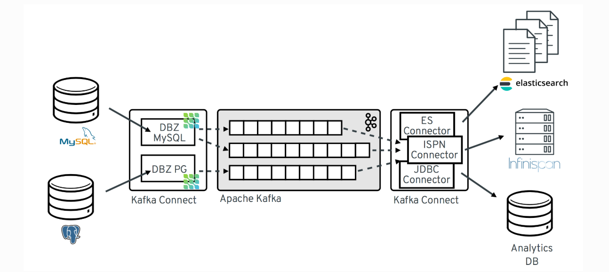

# REALTIME RESEARCH WITH KAFKA

This is a sample to setup kafka for streaming data between databases such as RDBMS and NoSQL. I use **Confluent Kafka** with connectors of third parties, such as **debezium** and **lenses**.

#### Technical

- Docker for deployment
- Databases: RDBMS (MySQL, Postgres), Elasticsearch, Cassandra
- Connectors, Kafka Connect and Apache Avro

#### Debezium Architecture



#### How to setup

- Bring up all containers: `docker-compose up -d`
- Initialize database for Cassandra:
  + Access cassandra container: `docker-compose exec cassandra cqlsh`
  + Pass code below to prompt window:
```sql
CREATE KEYSPACE demo WITH REPLICATION = {'class' : 'SimpleStrategy', 'replication_factor' : 3};
use demo;

CREATE TABLE orders (id int, created varchar, product varchar, qty int, price float, PRIMARY KEY (id, created))
WITH CLUSTERING ORDER BY (created ASC);

CREATE TABLE demo_orders (id int, created varchar, product varchar, qty int, price float, PRIMARY KEY (id, created))
WITH CLUSTERING ORDER BY (created ASC);
```

##### Setup source connectors
- Mysql Source with **Avro Converter**, publishes database ***demo***
```shell
curl -i -X POST http://localhost:8083/connectors/ \
     -H "Accept:application/json" \
     -H  "Content-Type:application/json" \
     -d '
    {
        "name": "source-mysql-demo",
        "config": {
            "connector.class": "io.debezium.connector.mysql.MySqlConnector",
            "tasks.max": "1",
            "database.hostname": "mysql",
            "database.port": "3306",
            "database.user": "debezium",
            "database.password": "dbz",
            "database.server.id": "191031",
            "database.server.name": "mysqlserver",
            "database.whitelist": "demo",
            "database.history.kafka.bootstrap.servers": "broker:9092",
            "database.history.kafka.topic": "schema-changes.demo",
            "key.converter": "io.confluent.connect.avro.AvroConverter",
            "key.converter.schema.registry.url": "http://schema-registry:8081",
            "value.converter": "io.confluent.connect.avro.AvroConverter",
            "value.converter.schema.registry.url": "http://schema-registry:8081",
            "internal.key.converter": "org.apache.kafka.connect.json.JsonConverter",
            "internal.value.converter": "org.apache.kafka.connect.json.JsonConverter",
            "transforms": "route",
            "transforms.route.type": "org.apache.kafka.connect.transforms.RegexRouter",
            "transforms.route.regex": "([^.]+)\\.([^.]+)\\.([^.]+)",
            "transforms.route.replacement": "$3"
        }
    }'
```

- Postgres Source publishes schema ***test***
```shell
curl -i -X POST http://localhost:8083/connectors/ \
     -H "Accept:application/json" \
     -H  "Content-Type:application/json" \
     -d '
    {
        "name": "source-pg-test",
        "config": {
            "connector.class": "io.debezium.connector.postgresql.PostgresConnector",
            "tasks.max": "1",
            "database.hostname": "postgres",
            "database.port": "5432",
            "database.user": "postgresuser",
            "database.password": "postgrespw",
            "database.dbname" : "inventory",
            "database.server.name": "pgserver",
            "schema.whitelist": "test",
            "database.history.kafka.bootstrap.servers": "broker:9092",
            "database.history.kafka.topic": "schema-changes.test",
            "transforms": "route",
            "transforms.route.type": "org.apache.kafka.connect.transforms.RegexRouter",
            "transforms.route.regex": "([^.]+)\\.([^.]+)\\.([^.]+)",
            "transforms.route.replacement": "$3"
        }
    }'
```

##### Setup Sink Connectors
- ES subscribes **customers** topic from demo schema of mysql source
```sh
curl -i -X POST http://localhost:8083/connectors/ \
     -H "Accept:application/json" \
     -H  "Content-Type:application/json" \
     -d '
     {
        "name": "sink-es-testtable",
        "config": {
            "connector.class": "io.confluent.connect.elasticsearch.ElasticsearchSinkConnector",
            "tasks.max": "1",
            "topics": "testtable",
            "type.name": "testtable",
            "connection.url": "http://es6:9200",
            "transforms": "unwrap,key",
            "transforms.unwrap.type": "io.debezium.transforms.ExtractNewRecordState",
            "transforms.unwrap.drop.tombstones": "false",
            "transforms.key.type": "org.apache.kafka.connect.transforms.ExtractField$Key",
            "transforms.key.field": "test_id",
            "key.ignore": "false",
            "behavior.on.null.values": "delete"
        }
    }'
```
- Cassandra subscribes **customers** topic from database demo
```shell
curl -i -X POST http://localhost:8083/connectors/ \
     -H "Accept:application/json" \
     -H  "Content-Type:application/json" \
     -d '
    {
        "name": "sink-es-customers",
        "config": {
            "connector.class": "io.confluent.connect.elasticsearch.ElasticsearchSinkConnector",
            "tasks.max": "1",
            "topics": "customers",
            "connection.url": "http://es6:9200",
            "transforms": "unwrap,key",
            "transforms.unwrap.type": "io.debezium.transforms.ExtractNewRecordState",
            "transforms.unwrap.drop.tombstones": "false",
            "transforms.key.type": "org.apache.kafka.connect.transforms.ExtractField$Key",
            "transforms.key.field": "id",
            "key.ignore": "false",
            "type.name": "customer",
            "behavior.on.null.values": "delete"
        }
    }'
```

#### Time to test

- Test consumer

```sh
docker-compose exec broker kafka-console-consumer \
    --bootstrap-server broker:9092 \
    --from-beginning \
    --property print.key=true \
    --topic orders
```

```sh
docker-compose exec schema-registry /usr/bin/kafka-avro-console-consumer \
    --bootstrap-server broker:9092 \
    --from-beginning \
    --property print.key=true \
    --property schema.registry.url=http://schema-registry:8081 \
    --topic orders
```

- Test elasticsearch
```sh
curl localhost:9200/testtable/_search
```

- Test cassandra
```sh
docker-compose exec cassandra csqlsh
> use demo;
> select * from orders;
```
